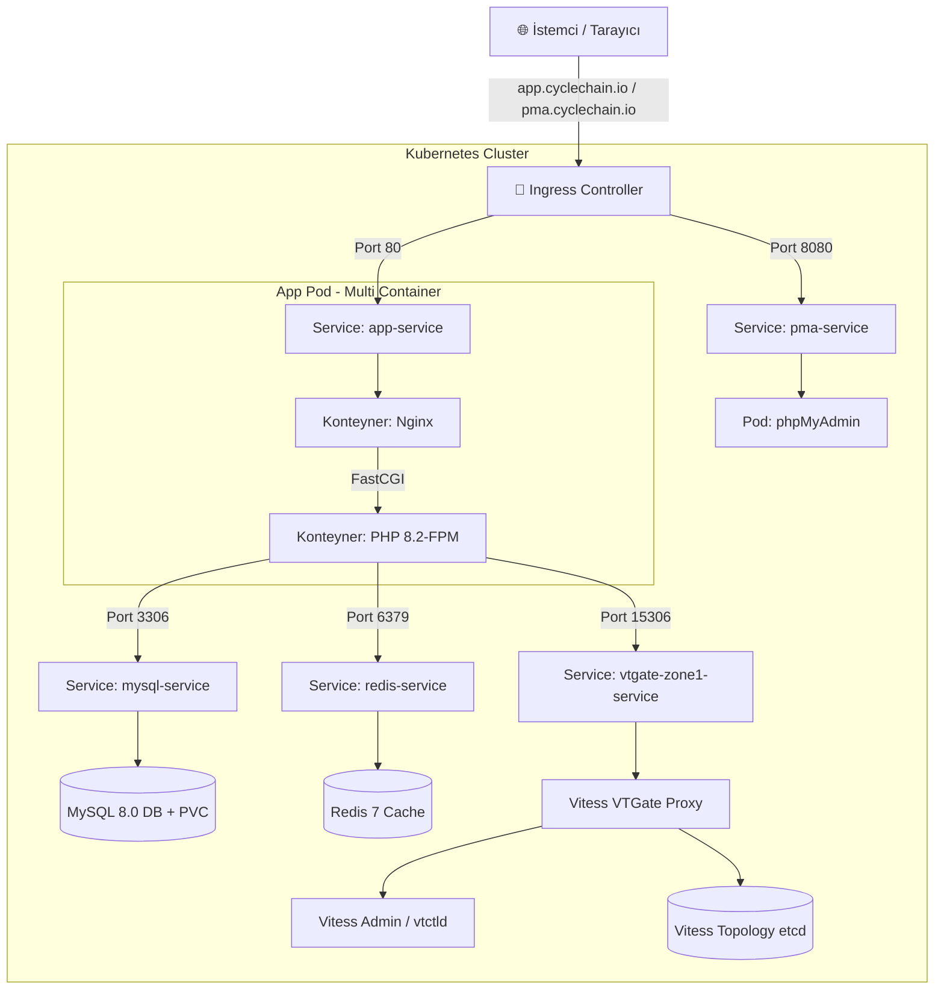

# Enterprise Kubernetes Microservices & Vitess Sharding Boilerplate

[](https://kubernetes.io/)
[](https://vitess.io/)
[](https://www.php.net/)
[](https://redis.io/)
[](https://www.mysql.com/)
[](https://kustomize.io/)

Bu proje, **Endüstri Standardı (In-The-Wild)** mimari prensipleriyle hazırlanmış, production-ready bir **Kubernetes Mikroservis & Yatay Veritabanı Bölümleme (Vitess Sharded MySQL)** başlangıç şablonudur (Boilerplate). 

Geliştiricilerin ve DevOps mühendislerinin bulut ortamında (EKS, GKE, AKS) veya yerel ortamlarda (Minikube, MicroK8s) yüksek erişilebilirlikli (HA), ölçeklenebilir ve güvenli uygulamalar ayağa kaldırması için tasarlanmıştır.

---

## 🏛️ Mimari Özellikler ve Bileşenler

Proje aşağıdaki modern mikromimari bileşenlerini içerir:

* 🚀 **Multi-Container App Pod (Nginx + PHP-FPM 8.2)**: Nginx Alpine ve PHP 8.2-FPM konteynerlerini tek bir Pod içerisinde `initContainer` dosya senkronizasyonu ile çalıştırır. Composer ve GuzzleHTTP entegredir.
* ⚡ **Vitess CNCF MySQL Sharding Cluster**: MySQL veritabanlarını yatay olarak bölümleyen CNCF mezunu Vitess kümesi (`VitessCluster`), `vtctld` yönetim paneli ve `vtgate` MySQL proxy bileşenlerini barındırır. Statik kimlik doğrulama (`vtgate-auth`) yapılandırılmıştır.
* 🔴 **Redis 7 Caching Layer**: Yüksek hızlı önbellekleme ve oturum yönetimi için Redis veritabanı servisi.
* 🐬 **MySQL 8.0 Primary Datastore**: Kalıcı depolama alanı (`PersistentVolumeClaim - PVC`) ve gizli bilgiler (`Secret`) ile korunan birincil ilişkisel veritabanı.
* 📈 **Horizontal Pod Autoscaler (HPA)**: Trafik dalgalanmalarına göre Pod sayısını otomatik olarak **min 2** - **max 10** arasında ölçeklendirir (CPU %70, RAM %80 eşiği).
* 🎯 **Kustomize (Base & Overlays Mimarisi)**: `base` katmanından türetilen `dev` ve `prod` ortamları ile kod tekrarı olmaksızın farklı konfigürasyonları yönetir.
* 🚦 **Ingress Controller & SSL (Let's Encrypt)**: Local geliştirmede `app.local` / `pma.local`, canlı ortamda `app.cyclechain.io` / `pma.cyclechain.io` domain yönlendirmeleri ve otomatik TLS sertifikasyonu.

---

## 📊 Sistem Mimari Şeması



---

## 📁 Proje Dosya ve Klasör Hiyerarşisi

```text
.
├── .dockerignore                 # Docker build sürecine dahil edilmeyecek dosyalar
├── app/                          # Uygulama Kaynak Kodları ve Dockerfile Klasörü
│   ├── Dockerfile                # PHP 8.2-FPM + Composer + GuzzleHTTP imaj tanımı
│   └── index.php                 # PHP uygulama kodları (MySQL, Redis, Vitess ve API testleri)
├── kustomization.yaml            # Kök dizin varsayılan Kustomize girişi
├── README.md                     # Proje dokümantasyonu
└── k8s/                          # Kubernetes Manifestleri Klasörü
    ├── base/                     # Temel (Base) Altyapı Tanımları
    │   ├── kustomization.yaml    # Base Kustomize konfigürasyonu (secretGenerator & configMapGenerator)
    │   ├── apps/                 # Uygulama Katmanı Manifestleri
    │   │   ├── app.yaml          # Nginx + PHP-FPM Deployment & App Service
    │   │   ├── hpa.yaml          # Horizontal Pod Autoscaler (Otomatik Pod Ölçeklendirme)
    │   │   ├── ingress.yaml      # HTTP Ingress Controller & Domain Yönlendirme
    │   │   └── phpmyadmin.yaml   # phpMyAdmin Deployment & Service
    │   ├── configs/              # Konfigürasyon Dosyaları
    │   │   ├── default.conf      # Nginx Server Konfigürasyonu
    │   │   └── users.json        # Vitess VTGate MySQL Statik Kimlik Doğrulama Dosyası
    │   └── datastores/           # Veritabanı ve Önbellek Katmanı
    │       ├── mysql.yaml        # MySQL Secret, PVC, Deployment & Service
    │       ├── redis.yaml        # Redis Deployment & Service
    │       └── vitess.yaml       # Vitess CNCF MySQL Sharded Cluster & VTGate Service
    └── overlays/                 # Ortama Özel Yapılandırmalar (Environments)
        ├── dev/                  # Geliştirme (Development) Ortamı
        │   └── kustomization.yaml
        └── prod/                 # Canlı (Production) Ortamı
            ├── kustomization.yaml
            └── patches/
                └── ingress-patch.yaml  # Canlı Domain (cyclechain.io) ve SSL Yaması
```

---

## 🚀 Derleme ve Kurulum Adımları

### 1. Vitess Operatörünün (CRDs) Kümeye Yüklenmesi

Vitess veritabanı kümesini (`VitessCluster`) yönetebilmek için öncelikle Vitess Operator manifest dosyasının kütüğe uygulanması gerekmektedir:

```bash
kubectl apply -f https://raw.githubusercontent.com/vitessio/vitess/main/examples/operator/operator.yaml
```

### 2. VTGate Statik Kimlik Doğrulama Konfigürasyonu

Vitess Proxy (`vtgate`) varsayılan olarak `static` kimlik doğrulama kullanır. Kullanıcı bilgileri `k8s/base/configs/users.json` dosyasında tanımlıdır:

```json
{
  "app": [
    {
      "UserData": "app",
      "Password": "apppassword"
    }
  ]
}
```
Kustomize (`secretGenerator`), bu dosyayı otomatik olarak `vtgate-auth` adlı Kubernetes Secret'ına dönüştürür.

### 3. Özel Uygulama İmajının Derlenmesi

Minikube ortamında `app/` klasöründeki PHP ve Composer kütüphanelerini içeren imajı derlemek için:

```bash
minikube image build -t my-php-app:v1 ./app
```

### 4. Kustomize İle Altyapının Dağıtımı

**Geliştirme (Dev) Ortamı Dağıtımı:**
```bash
kubectl apply -k k8s/overlays/dev
```

**Canlı (Prod - cyclechain.io) Ortamı Dağıtımı:**
```bash
kubectl apply -k k8s/overlays/prod
```

**Kök Dizinden Otomatik Dağıtım:**
```bash
kubectl apply -k .
```

---

## 🌐 Ingress ve Domain Yapılandırması

### 1. Yerel Geliştirme Ortamı (Minikube & macOS)

Ingress eklentisini aktifleştirin:
```bash
minikube addons enable ingress
```

macOS Docker Driver erişimi için tüneli başlatın (ayrı terminalde açık tutun):
```bash
sudo minikube tunnel
```

Lokal DNS yönlendirmesini (`/etc/hosts`) tanımlayın:
```bash
sudo sh -c 'echo "127.0.0.1 app.local pma.local" >> /etc/hosts'
```

* **Web Uygulaması**: `http://app.local`
* **phpMyAdmin**: `http://pma.local`

---

### 2. Canlı Ortam Yapılandırması (`cyclechain.io`)

Production ortamında `k8s/overlays/prod` paketi kullanıldığında Ingress otomatik olarak canlı domainleri aktif eder:

* **Web Uygulaması**: `https://app.cyclechain.io`
* **phpMyAdmin**: `https://pma.cyclechain.io`

`cert-manager` ve Let's Encrypt entegrasyonu sayesinde SSL/TLS sertifikaları otomatik üretilir ve yenilenir.

---

## ⚡ Otomatik Ölçeklendirme (Auto-Scaling)

### Pod Seviyesi (HPA)
Metrics Server aktifleştirildiğinde (`minikube addons enable metrics-server`), HPA yük durumuna göre Pod sayısını dinamik yönetir:
```bash
kubectl get hpa
```

### Node / Cluster Seviyesi
Bulut ortamlarında (AWS EKS, GCP GKE) Pod kapasitesi dolduğunda **Karpenter** veya **Cluster Autoscaler** otomatik olarak bulut sunucusu (EC2/VM) ekler ve siler.

---

## 🔍 İzleme ve Faydalı Komutlar

| Komut | Açıklama |
| :--- | :--- |
| `kubectl get pods` | Kümedeki tüm Pod'ların durumunu listeler. |
| `kubectl get hpa` | Otomatik ölçeklendirme ve CPU/RAM kullanım metriklerini izler. |
| `kubectl get ingress` | Ingress kurallarını, yönlendirmeleri ve adresleri listeler. |
| `kubectl logs -l planetscale.com/component=vtgate` | Vitess VTGate proxy loglarını canlı izler. |
| `kubectl port-forward svc/app-service 30080:80` | Web uygulamasını `http://localhost:30080` portuna sabit bağlar. |
| `kubectl port-forward svc/pma-service 30880:8080` | phpMyAdmin'i `http://localhost:30880` portuna sabit bağlar. |

---

## 📄 Lisans

Bu proje MIT Lisansı ile lisanslanmıştır. Dilediğiniz gibi çatallayabilir (fork), kendi projelerinizde başlangıç şablonu (boilerplate) olarak özgürce kullanabilirsiniz.
